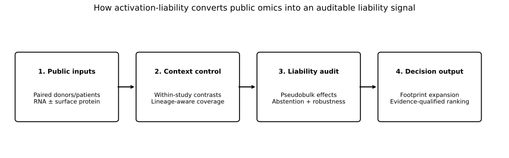
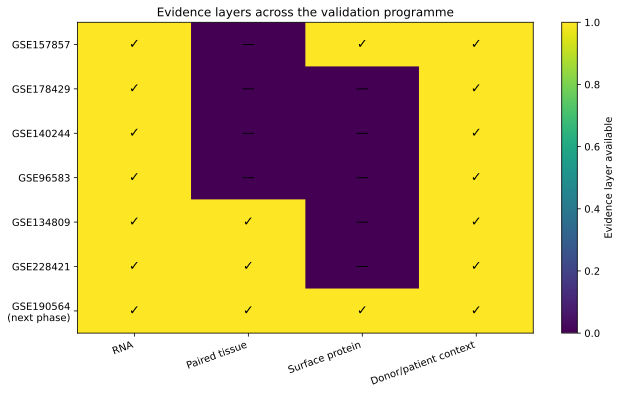
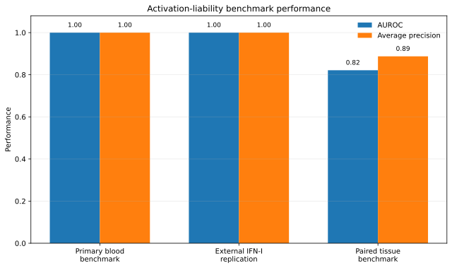
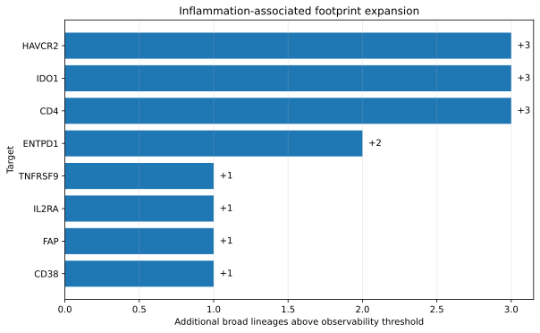

# activation-liability

**CLI:** `alia`  
**Purpose:** audit how much of a surface target's apparent tumour selectivity disappears when normal cells are inflamed or immune-activated rather than resting.

> **Scientific boundary:** this is a liability detector with abstention. It does **not** predict toxicity, establish a therapeutic window, or prove accessible surface protein from RNA.


<p align="center">
  
</p>

<p align="center">
  <a href="https://drive.google.com/drive/folders/1f3K-MzEQDsUFmMIb5cnFxH47_G-HYPKN"><strong>Public data and releases on Google Drive</strong></a> ·
  <a href="docs/index.html">Visual project overview</a> ·
  <a href="docs/GSE190564_NEXT_PHASE.md">Next phase: GSE190564</a> ·
  <a href="README_ES.md">Resumen en español</a>
</p>

[](https://github.com/rsolerortuno/activation-liability/actions/workflows/ci.yml)

**Runtime:** Python ≥3.11 · **License:** [Apache License 2.0](LICENSE) · **CLI:** `alia`  
**Verified release:** [52 tests](tests/) · [85.38% non-I/O coverage](docs/PUBLIC_RELEASE_VERIFICATION.md) · RNA + paired-tissue evidence

## Runnable repository

This repository contains the **working software**, not only a results page. Installing the project
creates the `alia` command-line application. The repository includes:

- the Python package in [`src/activation_liability/`](src/activation_liability/);
- the complete CLI and all supported commands;
- 52 automated tests in [`tests/`](tests/);
- a real GitHub Actions workflow in [`.github/workflows/ci.yml`](.github/workflows/ci.yml);
- frozen benchmark and tissue-analysis configuration;
- download, validation and release-building scripts;
- compact, auditable result artefacts from the executed public cohorts;
- source-data manifests, official URLs and checksums;
- methods, assumptions, decisions and limitations.

Multi-gigabyte GEO archives are deliberately **not vendored in GitHub**. They remain available from
GEO and the public Drive mirror, while this repository records their identities and checksums so
another user can download the same inputs and reproduce the analysis. See
[`docs/REPOSITORY_STRUCTURE.md`](docs/REPOSITORY_STRUCTURE.md) and
[`docs/DATA.md`](docs/DATA.md).

## The problem

A target can look tumour-selective in resting healthy references and lose that selectivity when
normal cells encounter interferons, innate immune activation, tissue damage or lymphocyte
stimulation. This hidden **activation-induced expression liability** can matter for antibodies,
ADCs, bispecifics, CAR-based therapies and other modalities that depend on surface-accessible
targets.

`activation-liability` (`alia`) is an auditable research pipeline for detecting that risk before a
target is treated as safely selective. It asks a narrow question:

> **How much does a target's normal-cell expression footprint expand when biologically matched
> resting tissue is replaced by activated or inflamed tissue?**

## Why it is useful

The tool is designed for early target triage and evidence review. It can:

- identify targets whose normal-cell footprint expands under inflammation;
- show the donors, tissues, lineages and stimuli driving the signal;
- distinguish robust donor-level effects from cell-level pseudo-replication;
- abstain when a target or expected lineage is not adequately observed;
- preserve negative or contradictory results instead of optimising them away;
- produce machine-readable claims that state what the evidence does and does not support.

The output is a **liability signal**, not a toxicity prediction. Delivery, accessible protein density,
pharmacokinetics and clinical safety remain separate evidence layers.

## Evidence programme

<p align="center">
  
</p>

The current public release includes four blood/sorted-cell cohorts, an untouched external IFN-I
replication, and paired Crohn ileum and psoriasis skin cohorts. The next phase is
[GSE190564](docs/GSE190564_NEXT_PHASE.md), a colon CITE-seq dataset with GEX and ADT that can
add matched surface-protein evidence. It is **not included in the current headline results**.

## Current headline results

<p align="center">
  
</p>

The paired-tissue benchmark evaluates 15 observable tier-1 controls and achieves AUROC 0.821 and
average precision 0.887. It deliberately retains context-dependent failures such as CD79A rising
in psoriasis B cells and CD69 falling in Crohn NK cells. Eight positive controls expand into
additional broad lineages during inflammation.

<p align="center">
  
</p>

## Public data access

The source code, compact derived results and checksums belong in the public repository. Large raw
public cohorts are not committed to Git. Their official GEO locations and optional Drive mirrors
are indexed in [docs/DRIVE_DATA_INDEX.md](docs/DRIVE_DATA_INDEX.md).

- **Drive root:** [https://drive.google.com/drive/folders/1f3K-MzEQDsUFmMIb5cnFxH47_G-HYPKN](https://drive.google.com/drive/folders/1f3K-MzEQDsUFmMIb5cnFxH47_G-HYPKN)
- **Auditable result artefacts:** [https://drive.google.com/drive/folders/1AQjydxf1Z_Y0bdJ27IQc8Ca1gwVlHPcy](https://drive.google.com/drive/folders/1AQjydxf1Z_Y0bdJ27IQc8Ca1gwVlHPcy)
- **Release files:** [https://drive.google.com/drive/folders/1vWfWckJ-euzDClLFYG-hpmDGjyGL0yyw](https://drive.google.com/drive/folders/1vWfWckJ-euzDClLFYG-hpmDGjyGL0yyw)
- **GSE190564 next-phase folder:** [https://drive.google.com/drive/folders/11hz8VhGV2bcSGp3dWmeQlufIsIeZQAzF](https://drive.google.com/drive/folders/11hz8VhGV2bcSGp3dWmeQlufIsIeZQAzF)

For a public release, share the Drive folder as **Anyone with the link → Viewer**. Keep edit access
restricted to the owner and named collaborators. Public edit access would allow strangers to
replace or delete scientific inputs.

## Why this exists

Healthy-donor references can miss normal-cell expression induced by interferon signalling, tissue damage or lymphocyte activation. `alia` estimates that hidden expansion using donor-paired, within-study contrasts and reports the cell types, stimuli, heterogeneity, protein corroboration and evidence gaps behind every call.

The primary analysis never compares absolute expression across studies and never treats cells as independent replicates.

## What it produces

For each `target × cell type × stimulus`:

- donor-pseudobulk paired RNA log2 fold change, 95% CI and adjusted p-value;
- random-effects meta-analysis and I²;
- resting and activated positive-cell fractions;
- matched ADT concordance where available;
- evidence class `A`, `B`, `C` or `INSUFFICIENT`;
- explicit abstention reasons.

For each target it also reports `footprint_expansion`, same-study `selectivity_erosion`, a ranked summary and a machine-readable `claims.json` contract listing permitted, conditional and unsupported claims.

## Quick start

```bash
python -m venv .venv
source .venv/bin/activate
python -m pip install -e '.[dev]'

alia validate-manifest data/registry
alia build --synthetic --output /tmp/alia_synthetic.csv
alia audit --input /tmp/alia_synthetic.csv --output results/local_audit
alia benchmark --input /tmp/alia_synthetic.csv --output results/local_benchmark
alia sensitivity --input /tmp/alia_synthetic.csv --output results/local_sensitivity.json
alia report --results results/local_benchmark/benchmark.json --output results/local_report.html

# After downloading the frozen public cohorts:
alia real-validate --data-root /path/to/activation-liability-real-data \
  --output results/real/public_v0_4_0

# Paired tissue extension after extracting the two tissue cohorts:
alia tissue-validate \
  --crohn-tar /path/to/GSE134809_RAW.tar \
  --psoriasis-directory /path/to/GSE228421_baseline_members \
  --output results/real/public_v0_5_0
```

`uv` is the intended environment manager (`uv sync --extra dev`), but no lockfile is committed because the build sandbox could not resolve registry packages. See `docs/DECISIONS.md` rather than treating an invented lock as reproducibility.

## Paired tissue-inflammation extension (v0.5.0)

Version 0.5.0 adds two within-patient tissue contrasts without changing the frozen v0.4
PBMC/sorted-cell results: nine primary Crohn ileum pairs from GSE134809 and five baseline
lesional/non-lesional psoriasis skin pairs from GSE228421. Two additional Crohn pairs are
reported only as a predeclared sensitivity because the source publication excluded them from
comparative analyses. Crohn epithelial claims are disabled because the original tissue
dissociation design did not support them.

Broad lineage assignment is condition-blind and uses marker modules that are disjoint from all
benchmark targets. An initial marker-only QC found keratinocytes being misclassified as plasma
cells; the provisional skin result was discarded, the marker panel was repaired before the final
benchmark, and the decision is recorded in `docs/DECISIONS.md`. Primary effects remain paired
donor log-CPM differences. A donor-fixed-effect negative-binomial GLM is a declared sensitivity.

The committed tissue results are in `results/real/public_v0_5_0/`.

| Tissue evaluation | Result |
|---|---:|
| Observable tier-1 controls | **<span data-alia-tissue-result="tissue_benchmark.tier1_metrics.n">15</span>** |
| Tier-1 positives / negatives | **<span data-alia-tissue-result="tissue_benchmark.tier1_metrics.n_positive">8</span> / <span data-alia-tissue-result="tissue_benchmark.tier1_metrics.n_negative">7</span>** |
| Tier-1 AUROC | **<span data-alia-tissue-result="tissue_benchmark.tier1_metrics.auroc">0.821429</span>** |
| Tier-1 average precision | **<span data-alia-tissue-result="tissue_benchmark.tier1_metrics.average_precision">0.887351</span>** |
| One-sided control-separation p-value | **<span data-alia-tissue-result="tissue_benchmark.tier1_metrics.mann_whitney_p_one_sided">0.020047</span>** |
| Tier-1+2 AUROC | **<span data-alia-tissue-result="tissue_benchmark.tier1_tier2_metrics.auroc">0.761364</span>** |
| Tier-1+2 average precision | **<span data-alia-tissue-result="tissue_benchmark.tier1_tier2_metrics.average_precision">0.904126</span>** |
| Newly observable targets versus v0.4 | **<span data-alia-tissue-result="coverage_gain.newly_observable_count">4</span>** |
| Targets with positive footprint expansion | **<span data-alia-tissue-result="footprint_summary.targets_with_positive_expansion">8</span>** |
| Maximum broad-lineage footprint expansion | **<span data-alia-tissue-result="footprint_summary.maximum_expansion">3</span>** |
| Stable NB fits | **<span data-alia-tissue-result="negative_binomial_sensitivity.n_valid">503</span>** |
| Primary/NB effect Spearman correlation | **<span data-alia-tissue-result="negative_binomial_sensitivity.spearman_effect_correlation">0.856452</span>** |
| Primary/NB direction agreement | **<span data-alia-tissue-result="negative_binomial_sensitivity.direction_agreement">0.916501</span>** |
| Crohn 9-pair versus 11-pair effect correlation | **<span data-alia-tissue-result="crohn_published_exclusion_sensitivity.spearman_effect_correlation">0.939467</span>** |
| Leave-one-donor-out direction-stable drivers | **<span data-alia-tissue-result="donor_robustness.direction_stable_count">27</span> / <span data-alia-tissue-result="donor_robustness.n_rows">30</span>** |

The tissue benchmark is intentionally not perfect. `CD79A` rises in psoriasis B cells despite its
negative-control label, while `CD69` falls in Crohn NK cells despite being a positive control.
These context-dependent failures are retained. Four targets become observable only after adding
tissue coverage: `ERBB2`, `FAP`, `TNFRSF17` and `VCAM1`. RNA evidence remains insufficient for
a surface-protein or clinical-toxicity claim.

## Public real-data benchmark and external IFN-I replication (v0.4.0)

The committed real-data layer contains the original frozen benchmark plus an independently
processed replication cohort. The primary benchmark uses donor-paired, within-study contrasts
from GSE157857, GSE178429 and GSE140244. Its four frozen endpoints remain IFN-beta 18 h,
IFN-gamma 6 h, LPS 6 h and anti-CD3/CD28 24 h. Nothing in that score was retuned after GSE96583
was opened.

Primary results are backed by `results/real/public_v0_4_0/benchmark.json`; the complete external
replication is in `results/real/public_v0_4_0/gse96583_confirmation_benchmark.json`. A standalone
report is committed at `results/real/public_v0_4_0/report.html`.

### Frozen primary benchmark

| Evaluation | Result |
|---|---:|
| Observable tier-1 controls | **<span data-alia-real-result="coverage.observable_tier1_controls">15</span> / <span data-alia-real-result="coverage.tier1_controls">19</span>** |
| Primary tier-1 AUROC | **<span data-alia-real-result="primary_tier1_metrics.auroc">1.000000</span>** |
| Primary tier-1 average precision | **<span data-alia-real-result="primary_tier1_metrics.average_precision">1.000000</span>** |
| Primary positives / negatives | **<span data-alia-real-result="primary_tier1_metrics.n_positive">9</span> / <span data-alia-real-result="primary_tier1_metrics.n_negative">6</span>** |
| Expanded tier-1+2 AUROC | **<span data-alia-real-result="expanded_tier1_tier2_metrics.auroc">0.934783</span>** |
| Expanded tier-1+2 average precision | **<span data-alia-real-result="expanded_tier1_tier2_metrics.average_precision">0.985405</span>** |
| AUROC after omitting IFN-I | **<span data-alia-real-result="endpoint_leave_one_out.IFN_I_18h.metrics_on_remaining_observable_primary_targets.auroc">0.944444</span>** |
| AUROC after omitting IFN-II | **<span data-alia-real-result="endpoint_leave_one_out.IFN_II_6h.metrics_on_remaining_observable_primary_targets.auroc">0.944444</span>** |
| Invalid cross-study AUROC | **<span data-alia-real-result="required_ablations.within_study_vs_cross_study.INVALID_FOR_INFERENCE_cross_study.auroc">0.866667</span>** |
| Cell-level / pseudobulk call inflation | **<span data-alia-real-result="required_ablations.pseudobulk_vs_cell_level.inflation_ratio">1.530769</span>×** |

The perfect tier-1 separation concerns a small curated set with six observable negatives. Four
tier-1 negatives from plasma-cell or epithelial lineages abstain rather than being counted as easy
zeros. The original target holdout remains **diagnostic, not confirmatory**, because the constrained
primary endpoints and score were finalised after an earlier unconstrained real run was inspected.

### GSE96583 external replication under unchanged v0.3 rules

GSE96583 was opened only after the authoritative deposited gene-order file became available. The
adapter verified all 35,635 matrix rows, eight donor identities, singlet calls and exact condition
alignment. It also resolved 313 raw 10x barcode sequences that occur in both libraries by reversing
the condition-specific row-name suffix used in the deposited metadata; every barcode then matched
one-to-one.

| Evaluation | Result |
|---|---:|
| Observable tier-1 controls | **<span data-alia-confirm-result="coverage.observable_tier1_controls">11</span> / <span data-alia-confirm-result="coverage.tier1_controls">19</span>** |
| Tier-1 positives / negatives | **<span data-alia-confirm-result="tier1_ranking_metrics.n_positive">6</span> / <span data-alia-confirm-result="tier1_ranking_metrics.n_negative">5</span>** |
| Tier-1 AUROC | **<span data-alia-confirm-result="tier1_ranking_metrics.auroc">1.000000</span>** |
| Tier-1 average precision | **<span data-alia-confirm-result="tier1_ranking_metrics.average_precision">1.000000</span>** |
| Frozen-cutoff balanced accuracy | **<span data-alia-confirm-result="frozen_cutoff_classification_tier1.balanced_accuracy">0.750000</span>** |
| Frozen-cutoff sensitivity | **<span data-alia-confirm-result="frozen_cutoff_classification_tier1.sensitivity">0.500000</span>** |
| Frozen-cutoff specificity | **<span data-alia-confirm-result="frozen_cutoff_classification_tier1.specificity">1.000000</span>** |
| Score correlation with v0.3 | **<span data-alia-confirm-result="agreement_with_v0_3.spearman_score_correlation">0.841073</span>** |
| IFN-I myeloid effect correlation, 6 h vs 18 h | **<span data-alia-confirm-result="ifn_i_cross_time_replication.effect_spearman">0.707863</span>** |
| IFN-I effect-direction agreement | **<span data-alia-confirm-result="ifn_i_cross_time_replication.direction_agreement">0.684211</span>** |
| Observable positive targets in the preassigned holdout | **<span data-alia-confirm-result="target_holdout.observable_positive_targets#len">0</span> / 3** |

This is **partial external confirmation**, not full holdout confirmation. The observable control
ranking replicated, but the frozen cutoff recovered only half of observable positives and all three
preassigned positive holdout targets—IL2RA, PDCD1LG2 and TNFRSF9—fell below the frozen 5%
observability requirement. Their absence from the confirmatory score is an abstention, not a failed
negative call. At a 1% sensitivity threshold two holdout positives become observable, but that
post-threshold result is reported only as sensitivity analysis and does not replace the frozen
primary rule.

GSE96583 contains SLE-patient PBMCs rather than healthy donors, and it has no matched surface-protein
measurement. Cross-time IFN-I agreement between GSE96583 at 6 h and GSE157857 at 18 h is therefore
a descriptive replication sensitivity analysis, not an exact-endpoint heterogeneity estimate.
There is still no benchmark-control overlap with the available GSE157857 ADT panel, so no
protein-aware performance improvement is claimed.

## Committed synthetic benchmark

These numbers come from the deterministic synthetic fixture generator and are backed by `results/synthetic/benchmark.json`. They test implementation behaviour under planted truth; they are **not real-data validation**.

| Evaluation | Result |
|---|---:|
| Tier-1 holdout AUROC | **<span data-alia-result="holdout.holdout_metrics.auroc">0.966667</span>** |
| Tier-1 holdout average precision | **<span data-alia-result="holdout.holdout_metrics.average_precision">0.916667</span>** |
| All tier-1 AUROC | **<span data-alia-result="all_tier1_metrics.auroc">0.988889</span>** |
| All tier-1 average precision | **<span data-alia-result="all_tier1_metrics.average_precision">0.988889</span>** |
| Invalid cross-study AUROC | **<span data-alia-result="ablations.within_study_vs_cross_study.INVALID_FOR_INFERENCE_cross_study.auroc">0.655556</span>** |
| Cell-level / pseudobulk significant-call inflation | **<span data-alia-result="ablations.pseudobulk_vs_cell_level.inflation_ratio">3.473684</span>×** |
| RNA-only AUROC | **<span data-alia-result="ablations.rna_only_vs_protein_corroborated.rna_only.auroc">0.933333</span>** |
| Protein-corroborated AUROC | **<span data-alia-result="ablations.rna_only_vs_protein_corroborated.protein_corroborated_score.auroc">0.988889</span>** |
| Median Spearman across <span data-alia-result="ablations.detection_threshold_sweep.n_settings">27</span> threshold settings | **<span data-alia-result="ablations.detection_threshold_sweep.median_spearman">0.908962</span>** |

The holdout contains <span data-alia-result="holdout.holdout_positive_targets#len">3</span> positives and <span data-alia-result="holdout.negative_targets_used_in_both#len">10</span> negatives. Therefore holdout precision@10 = <span data-alia-result="holdout.holdout_metrics.precision_at_10">0.300000</span> means every available positive was present in the top ten; it should not be compared naively with all-tier-1 precision@10 = <span data-alia-result="all_tier1_metrics.precision_at_10">0.900000</span>.

### What the ablations show

- The valid within-study ranking substantially outperforms the deliberately invalid cross-study absolute comparison.
- Cell-level testing produces <span data-alia-result="ablations.pseudobulk_vs_cell_level.INVALID_FOR_INFERENCE_cell_level_significant_calls">66</span> significant calls versus <span data-alia-result="ablations.pseudobulk_vs_cell_level.pseudobulk_significant_calls">19</span> donor-pseudobulk calls, a <span data-alia-result="ablations.pseudobulk_vs_cell_level.inflation_ratio">3.473684</span>× inflation.
- A planted CD3E RNA-only technical artefact lowers RNA-only AUROC; matched ADT discordance improves the protein-aware ranking.
- Holdout accuracy is <span data-alia-result="holdout.coverage_vs_accuracy.0.accuracy">0.923077</span> at full coverage and reaches <span data-alia-result="holdout.coverage_vs_accuracy.1.accuracy">1.000000</span> after abstaining on the least-confident <span data-alia-result="holdout.coverage_vs_accuracy.1.abstention">0.230769</span> fraction of calls.
- The threshold sweep is labelled **STABLE** with median Spearman <span data-alia-result="ablations.detection_threshold_sweep.median_spearman">0.908962</span>. Stability here concerns the synthetic ranking only.

## Holdout discipline

The synthetic benchmark uses a deterministic SHA-256 30% positive holdout that is untouched until cutoff selection is complete. The original real-data split uses the same target assignment but remains diagnostic because the constrained primary endpoints and score were finalised after an earlier unconstrained run. GSE96583 was then evaluated without tuning as an external cohort; its observable ranking replicated, but the positive target holdout was not evaluable because all three held-out positives abstained at the frozen observability threshold. A paired tissue cohort is still required for a broader confirmatory claim.

Control labels live in `data/controls/controls.yaml`; each has a citation, rationale and confidence tier. A test asserts that registry accessions do not appear in control provenance.

## Real-data status

**Computed with partial external confirmation.** Four public cohorts are now converted and represented
in generated result artefacts: GSE157857, GSE178429, GSE140244 and the previously sealed GSE96583.
The GSE96583 result is an independent donor-resolved IFN-I replication under unchanged scoring,
lineage and observability rules. It supports the stability of the observable ranking, but it does
not confirm the preassigned positive target holdout because those targets abstain.

The project now includes independent paired Crohn ileum and psoriasis skin cohorts. The highest-value
remaining addition is matched surface-protein evidence in paired inflamed tissue, beginning with
GSE190564. The current evidence supports a strong reproducible portfolio project and a useful
liability-screening method demonstration; it does not support a universal safety claim or a 10/10
clinical-validation claim.

## Repository map

```text
src/activation_liability/   statistics, audit, benchmark, CLI and reporting
data/registry/              disabled candidate real-study manifests
data/candidates/            prioritized download catalog, never enabled by itself
scripts/                    resumable real-data bootstrap downloader
data/controls/              literature-derived benchmark controls
config/                     versioned evidence-class rules
docs/                       methods, assumptions, limitations, decisions, runbook
tests/                      analytic, adversarial, CLI and truthfulness tests
results/synthetic/          committed generated benchmark and audit artefacts
results/real/               computed public validation plus explicit unresolved blockers
```

## Reproducibility gates

CI runs formatting, lint, `mypy --strict`, Pyright, manifest validation, a synthetic end-to-end smoke run, tests and coverage. README quantitative values are parsed and checked against committed JSON, so a copied or stale headline fails CI.

The 2026-07-31 local verification used Ruff 0.16.0, mypy 2.3.0 and Pyright 1.1.411 installed from the user-provided offline tool bundle. Ruff lint/format, `mypy --strict`, Pyright, 38 tests and the configured coverage threshold all passed. A second real-data build reproduced the committed primary and confirmation artefacts byte-for-byte. See `docs/VERIFICATION.md` for exact commands and scope.

## Licence and citation

Apache-2.0. Citation metadata are in `CITATION.cff`.
