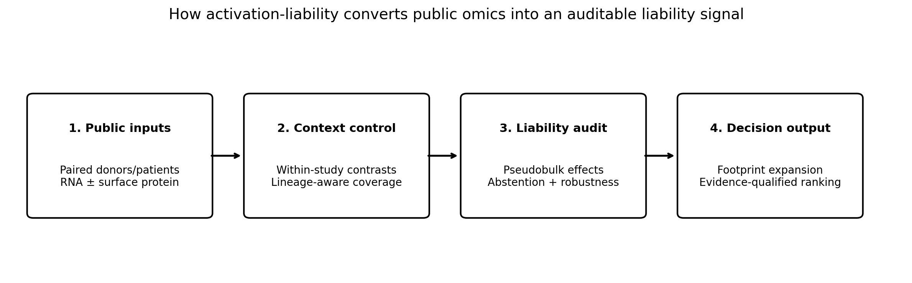
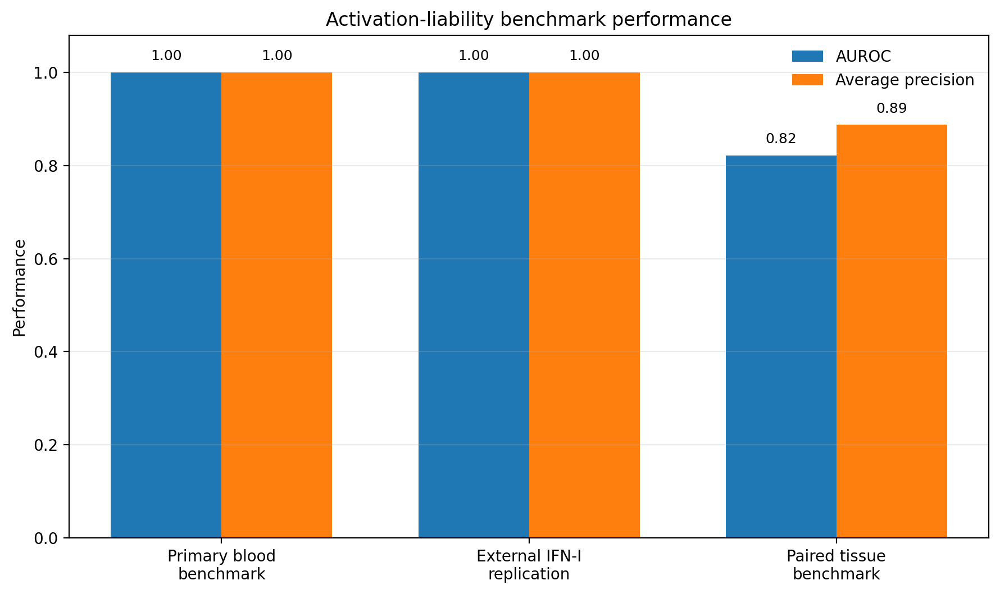
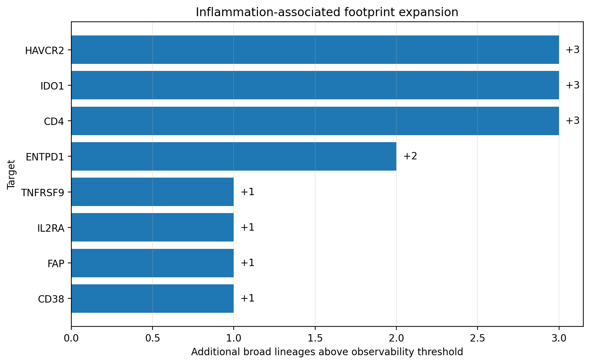

# activation-liability — resumen en español

**activation-liability** (`alia`) detecta cuánto puede desaparecer la aparente selectividad tumoral
de una diana superficial cuando las células normales se activan o se inflaman.

  

## Idea central

Las referencias sanas en reposo pueden ocultar expresión inducible por interferones, activación
inmune, daño tisular o estimulación de linfocitos. Esto puede ampliar el número de tejidos o tipos
celulares normales que expresan una diana y reducir su margen aparente de selectividad.

La herramienta compara muestras emparejadas dentro del mismo estudio y usa al donante o paciente
como unidad de réplica. Para cada diana informa:

- cambio de expresión pseudobulk y su intervalo de confianza;
- fracción de células positivas en reposo y activación;
- heterogeneidad y robustez al excluir donantes;
- expansión del footprint entre linajes;
- corroboración proteica cuando existe;
- abstención explícita cuando la cobertura es insuficiente.

## Utilidad

Está pensada para priorización temprana de dianas en anticuerpos, ADCs, biespecíficos, CAR y otras
modalidades dependientes de la accesibilidad superficial. No predice toxicidad clínica ni demuestra
una ventana terapéutica. Su función es revelar **liabilities que una referencia sana en reposo puede
pasar por alto**.

## Evidencia actual

- Benchmark sanguíneo/sorted-cell con GSE157857, GSE178429 y GSE140244.
- Réplica externa IFN-I con GSE96583 sin reajustar reglas.
- Validación tisular pareada en Crohn (GSE134809) y psoriasis (GSE228421).
- Sensibilidad negativa-binomial, leave-one-donor-out y contratos de claims.
- Próxima fase: GSE190564 para añadir RNA y proteína superficial en colon inflamado/no inflamado.

  

  

## Acceso

- [Datos, manifiestos y releases en Drive](https://drive.google.com/drive/folders/1f3K-MzEQDsUFmMIb5cnFxH47_G-HYPKN)
- [Resultados auditables](https://drive.google.com/drive/folders/1AQjydxf1Z_Y0bdJ27IQc8Ca1gwVlHPcy)
- [Carpeta de GSE190564](https://drive.google.com/drive/folders/11hz8VhGV2bcSGp3dWmeQlufIsIeZQAzF)
- [Guía completa de datos](docs/DRIVE_DATA_INDEX.md)
- [Plan de GSE190564](docs/GSE190564_NEXT_PHASE.md)

## Permisos recomendados

Para hacerlo público, configura la carpeta de Drive como **Cualquier persona con el enlace →
Lector**. Conserva la edición solo para tu cuenta y colaboradores concretos. Mientras la cuenta de
Google conectada mantenga permiso de edición, el asistente podrá seguir modificando los archivos;
no es necesario permitir edición pública.
